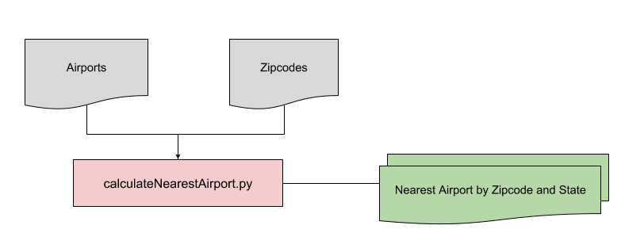
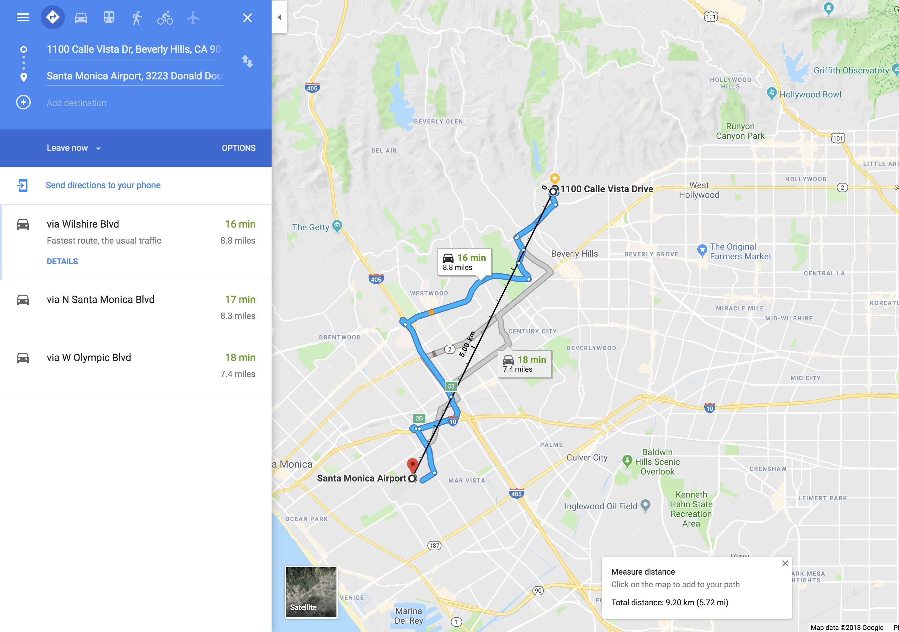
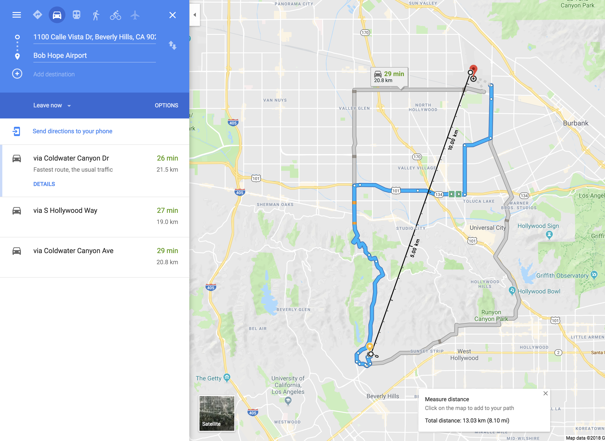

# Nearest Airport

_Calculate the nearest airport of each zipcode using Python. Based on Haversine formula_

## Overview

## Inputs

1. World Airports - Source: [Ourairports.com](http://ourairports.com/data/)
2. Zipcodes - Source: [AggData.con](https://www.aggdata.com/free/united-states-zip-codes)

## Output
1. CSV file per state/region, which contains the following:
  * All zipcodes
  * Nearest airport (code, lat and long) of each zipcode

## Business Use Case
1. Sales Territory Planning
  * Determine if any targeted location can easily be accessed.

## Sample Data: 90210, California

_Out of **558 airports** in California, what's the nearest airport to **Beverly Hills, LA**?_

| zipcode| country | state| state_full| county| latitude-zip| longitude-zip|  
| ---- | ---- |---- | ----  | ---- | ---- | ---- |  
| 90210	| US	| CA	| California| 	Los Angeles | 34.0901	| -118.4065|  

Based on the script, the nearest airport to 90210 is:

KSMO is **Santa Monica Municipal Airport**

| nearest-airport	| latitude-air | longitude-air|distance (km)|  
| ---- | ---- |---- | ----  |   
| KSMO	| 34.01580048	| -118.4509964| 	9.222835746 |  

Let's validate the model by plotting in Google Maps:  

The black line indicates the distance of 9.20 km from 90210 to the airport, which is close to 9.22km!

Note that the formula doesn't consider the actual roads in the location. Haversine simply calculates the distance from point A to point B.

Now, here's the second nearest airport: Bob Hope Airport (KBUR)

| nearest-airport	| latitude-air |   longitude-air|distance (km)|  
| ---- | ---- |---- | ----  |  
|KBUR	|34.20069885	|-118.3590012|	13.05176636|

Distance based on Haversine: 13.05 km
Distance based on Google Maps 13.03 km

## Notes

1. Nearest distance is based on [Haversine](https://stackoverflow.com/questions/41336756/find-the-closest-latitude-and-longitude) formula
2. Check out my [logs](logs.md) for more
